<h1 align="center">Desafio MVC | MVC Challenge</h1> 

Implementação de um sistema para cadastro, visualização, edição e deleção de dados referentes aos estagiários da GFT e suas atividades desenvolvidas, de acordo com as especificações dadas para a realização deste desafio. | Implementation of a system for registering, viewing, editing and deleting data related to GFT interns and their activities, in accordance with the specifications given for this challenge.

---

## :memo: Instruções do Desafio | Challenge Instructions

**<h3>Entidades do sistema | System entities</h3>**

- Starter (estagiário | intern)
    - Id
    - Nome | Name
    - Identificador de 4 letras | 4-letters identifier

- Programa Start | Start Program
    - Nome (ex: Turma 1, Turma 2...) | Name (eg: Program 1, Program 2...)
    - Data Inicial | Initial Date
    - Data Final | End Date

- Tecnologia | Technology
    - Nome (Java ou .NET) | Name (Java or .NET)
    - Descrição | Description

- Grupo/Time | Group/Team
    - Id
    - Tecnologia | Technology
    - ScrumMaster
    - Starter

- Módulo | Module
    - Nome (MVC Estudo, API Estudo, MVC Desafio...) | Name (MVC study, API challenge, MVC challenge...)
    - Daily
    - Projetos | Projects

- Daily
    - Data | Date
    - Fazendo | Doing
    - Feito | Done
    - Impedimentos | Impediments
    - Presença | Attendance

- Projeto | Project
    - Avaliação (Nota) | Evaluation (Grade)
    - Módulo | Module

**<h3>Regras Gerais | General Rules</h3>**
- Popular banco: com botão ou assim que iniciar a aplicação. | Data seed: with a button or as soon as the application starts.
- Criar CRUD para todas as entidades acima. | Create CRUD for all the entities above.
- Validação de todos os campos. | Validation of all fields. 
- Login Gerente com acesso a toda a aplicação. | Manager (admin) login with access to the entire aplication.
- Login Scrum Master com acesso apenas às dailies. | Scrum Master login with access to dailies only.
- Pode acrescentar e juntar entidades, caso necessário, mas não eliminar. | Entities can be added and joined together if necessary, but not eliminated.

**<h3>Exceeds</h3>**
- Cadastro de empregado com foto. | Employee registration with photo.

---
## :mag: Análise dos Relacionamentos | Relationships Analysis

Após a análise do relacionamento entre as entidades, alguns atributos propostos foram excluídos e o diagrama de relacionamentos ficou da seguinte forma: | After the analysis of the relationships between the entities, some of the proposed attributes were excluded and the relationship diagram is as follows: 

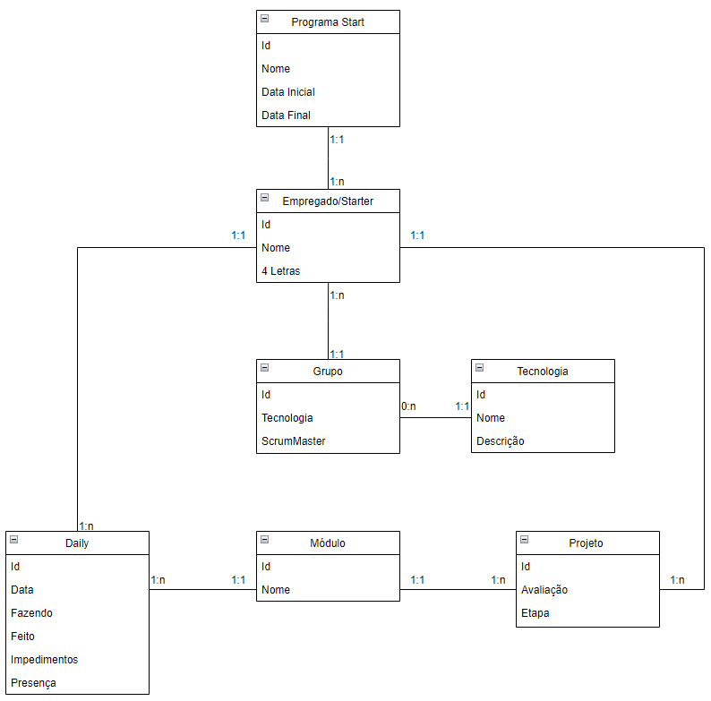

_
Figura 1 - Relacionamentos entre as entidades propostas | Figure 1 - Relationships between the proposed entities
_

A partir destes relacionamentos, pôde-se determinar as chaves primárias e estrangeiras de cada uma das classes. | From these relationships, it was possible to determine the primary and the foreign keys of each of the classes.

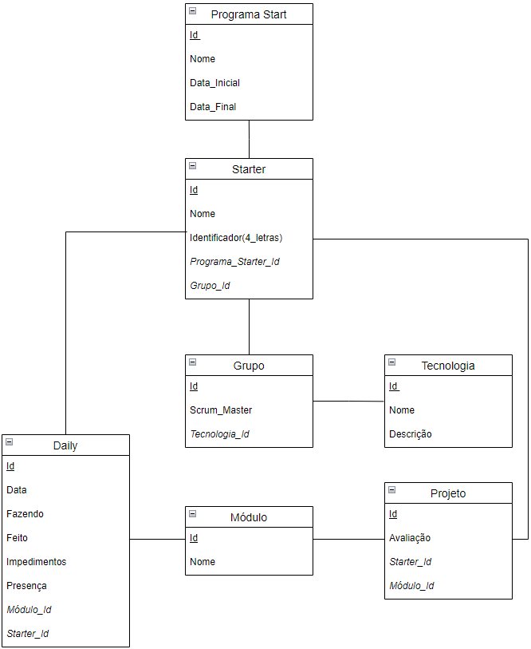

_
Figura 2 - Diagrama com os atributos de cada uma das entidades | Figure 2 - Diagram with the attributes of each one of the entities
_

Cabe ressaltar que esta análise foi feita especificamente para tratar da proposta inicial e que, durante o desenvolvimento, outros atributos, como Ids das entidades relacionadas para que a população do banco de dados fosse possível ou nome da imagem para realizar o exceed de cadastrar o empregado com foto, precisaram ser criados de acordo com a necessidade. | It is worth mentioning that the presented analysis was especifically made to address the initial proposal and other attributes, such as IDs of related entities needed for data seeding or image name needed for the exceed, had to be created according to the necessity during development. 

---
## :floppy_disk: Banco de Dados | Database

MySql foi configurado na porta 3306, com uid e senha iguais a root. O banco de nome estudo_mvc_mano será criado automaticamente quando a aplicação for iniciada pela primeira vez.
Serão criados automaticamente dois registros de cada uma das entidades acima relacionadas, além de um Administrador e três Scrum Masters. | MySql was configured on port 3306, with uid and password equal to root. The database named estudo_mvc_mano will be created automatically when the application is first launched. Two records for each of the entities listed above will be automatically created, in addition to an Administrator and three Scrum Masters. 

Os dados de login dos usuários criados automaticamente são os seguintes: | The automatically created user log data are as follows: 

| Papel/Role | Usuário/User | Senha/Password |
|---|------------|------|
| Admin | clecio.silva@gft.com | Gft2021 |
| Scrum Master | huguinho@gft.com | Scrum2021 |
| Scrum Master | luisinho@gft.com | Scrum2021 |
| Scrum Master | zezinho@gft.com | Scrum2021 | 

---
## :computer: Descrição do programa | Application description

**<h3> :page_with_curl: Registro de Usuário | User Registration </h3>**

As funcionalidades do programa só estarão disponíveis para os usuários logados. Para que um usuário possa se registrar, ele deverá, no momento do cadastro, informar uma das duas senhas especiais: | The software features will only be available to logged in users. A user will only be able to be registered if they enter one of the two special passwords at the time of registration: 

- Gft2021: com essa senha, o usuário será registrado como administrador; | Gft2021: with this password, the user will be registered as an administrator;
- Scrum2021: com essa senha, o usuário será registrado como Scrum Master. | Scrum2021: with this password, the user will be registered as a Scrum Master.

Caso o usuário não informe qualquer uma das duas senhas acima descritas, ele será levado novamente à página de registro e não será cadastrado no sistema. Além disso, quando do cadastro, cada usuário também deverá obrigatoriamente informar o nome completo. | If the user does not provide any of the two forementioned passwords, they will be taken back to the registration page and will not be registered. Moreover, each user must also inform their full name when registering.

**<h3> :page_with_curl: Home Page</h3>**

Após o login, cada tipo de usuário terá acesso a diferentes partes do sistema. O administrador poderá ver todas as funcionalidades, enquanto o Scrum Master terá acesso apenas às dailies e, mais especificamente, apenas às dailies daqueles Starters que estiverem registrados em algum de seus times Scrum. | After logging in, each type of user will have different access to the system features. An administrator will be able to access all the functionalities, while a Scrum Master will only be able to access to the dailies and, more specifically, only to the dailies of those Starters who are registered as a member in one of their Scrum teams. 

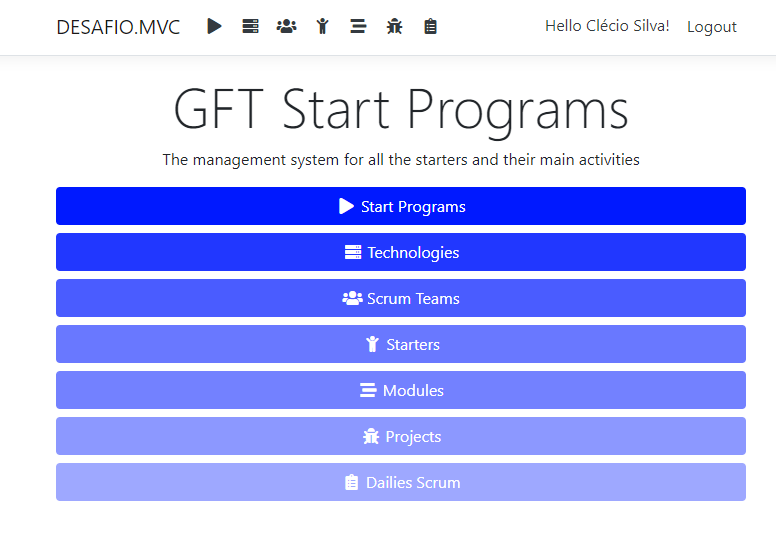

_
Figura 3 - Home page do administrador | Figura 3 - Administrator home page
_

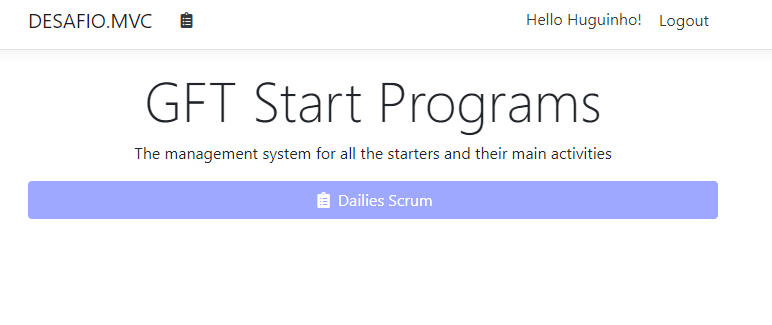

_
Figura 4 - Home page do Scrum Master | Figura 4 - Scrum Master home page
_

**<h3> :page_with_curl: Start Programs</h3>**

A página de programas mostrará a relação de todos os programas já cadastrados, além das opções de editar, deletar ou adicionar novo programa. | The programs page will show the list of all programs that were previously added, in addition to the options to edit, delete or add programs.

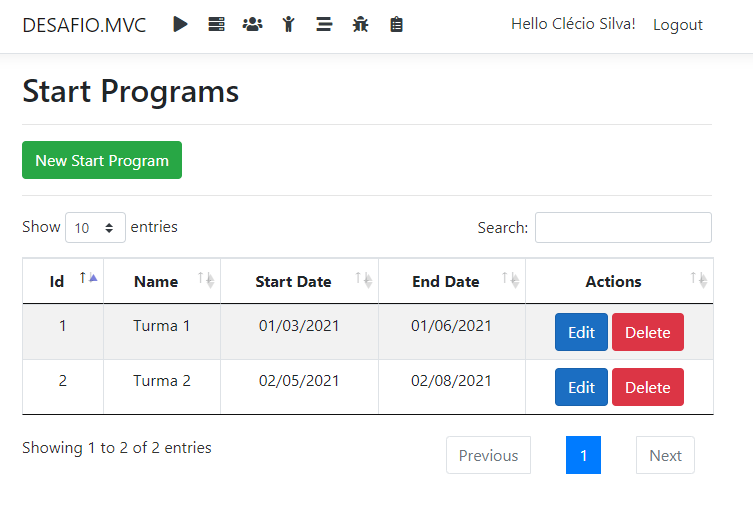

_
Figura 5 - Lista de programas ativos | Figure 5 - List of active programs
_

A criação de um novo registro estará condicionada à inclusão obrigatória do nome do programa e das datas de início e término. Além disso, o nome do programa não pode corresponder ao nome de um outro programa existente ativo. Caso o nome do novo programa seja igual ao nome de um programa existente inativo, o registro inativo será reativado ao invés da criação de um segundo registro com o mesmo nome. | The creation of a new registry will be conditioned to the mandatory inclusion of the name of the program and the initial and end dates. Besides that, the name of the program can't match the name of another existing active program. Should the name of the new program be equal to the name of another inactive program, the inactive registry will be reactivated instead of the creating of a second record with the same name. 

Similarmente à criação de novo programa, a edição de um programa já existente estará condicionado também à existência ou não de programa ativo com o novo nome alvo. | Similarly to the creation of a new program, the edition of an already existing program will also be conditioned to the existence or not of an active program with the new target name.

A deleção é do tipo lógico e seu registro não irá ser apagado do banco de dados, ele apenas não irá aparecer como opção válida aos usuários. | The deletion of any record is only logical and will not result in the actual deletion from the database, but will not appear as a valid option instead. 

**<h3> :page_with_curl: Technologies</h3>**

As regras de criação, edição e deleção de tecnologias segue a mesma lógica apresentada nos programas. Nesta plataforma, é possível a criação de quantas tecnologias forem necessárias, não sendo possível criar duas tecnologias com o mesmo nome. | The rules for creating, editing and deleting technologies follow the same logic used for the programs. On this platform, it is possible to create as many technologies as necessary, as long as no two technologies have the same name.

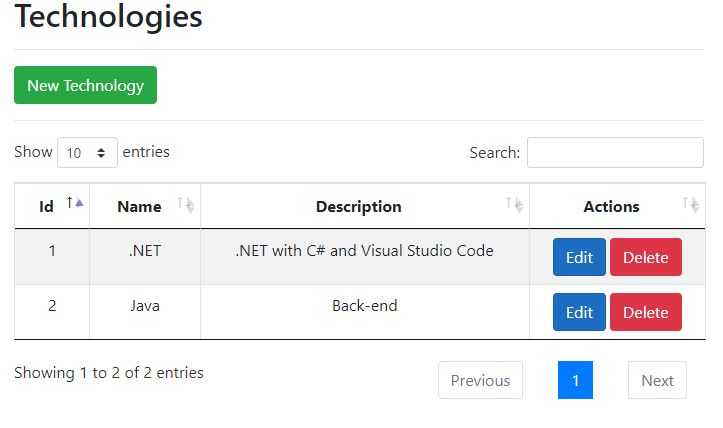

_
Figura 6 - Lista de tecnologias ativas | Figura 6 - List of active technologies 
_

**<h3> :page_with_curl: Scrum Teams</h3>**

A página de Scrum Teams também irá apresentar as funcionalidades de criação, edição e deleção de grupos. Cada Scrum Master que se registrou como usuário aparecerá como opção tanto no cadastro quanto na edição, e poderá estar presente em mais de um grupo diferente, independente da tecnologia. | The Scrum Teams page will also present to the user the possibilities to create, edit or delete groups. Each Scrum Master that has registered as a user will be shown as an option for both creating and editing registries, and may be added to multiple teams, regardless of the tecnology.

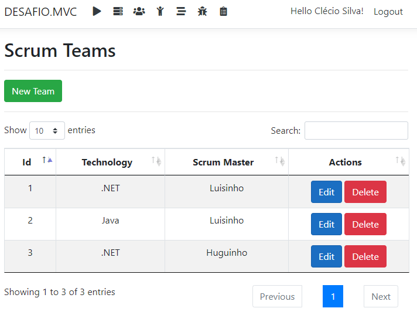

_
Figura 7 - Lista de Scrum Teams ativos | Figure 7 - List of active Scrum Teams
_

**<h3> :page_with_curl: Starters</h3>**

A página de Starters irá trazer os dados e as funcionalidades vistas anteriormente. A única diferença é o uso de imagens: o usuário poderá, na hora do cadastro e edição de starters, incluir uma foto de perfil. Caso não seja escolhida uma foto, haverá uma imagem padrão da GFT associada ao estagiário. Não poderá ser cadastrado um estagiário cujo identificador de 4 letras seja igual ao de um outro estagiário, ativo ou não, já cadastrado no banco de dados. | The Starters page brings the same functionalities seen previously. The only major difference is the usage of images: the user may include a profile picture when registering or editing starters. If no picture is selected, a default GFT image will be associated with the intern. An intern will not be registered if the provided 4-letter identifier matches that of another intern, active or not, in the database.

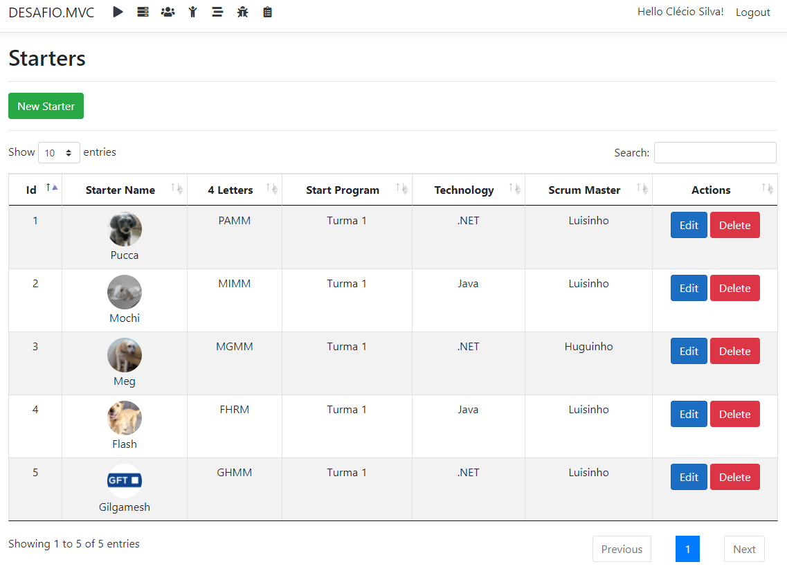

_
Figura 8 - Lista de Starters ativos | Figure 8 - List of active Starters
_

**<h3> :page_with_curl: Modules</h3>**

Os módulos não possuem relacionamentos e terão apenas um nome cadastrado. Um mesmo módulo não poderá ser registrado duas vezes e, na tentativa de criar ou editar um módulo com o nome de outro inativo, este último será reativado. | The modules do not have any relationships and must have only a name for registration. One module name can't be registered more than once, and an inactive module will be simply reactivated if the user tries to include a new module with the same name of an inactive one.

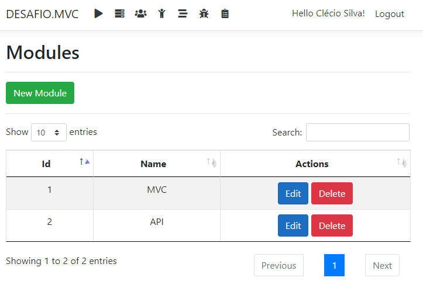

_
Figura 9 - Lista de Módulos ativos | Figura 9 - List of active Modules
_

**<h3> :page_with_curl: Projects</h3>**

Página responsável por mostrar as notas dos starters de acordo com o módulo em questão. | Page responsible for showing the starters' grades according to the module in question.

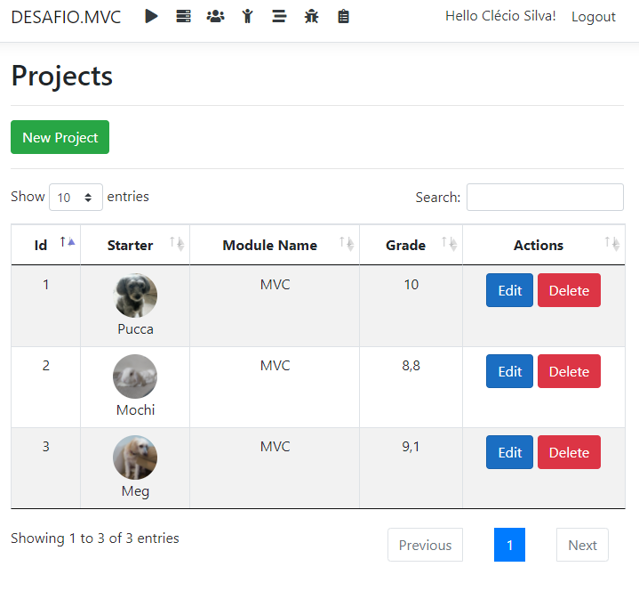

_
Figura 10 - Lista de Projetos ativos | Figure 10 - List of active Projects
_

**<h3> :page_with_curl: Dailies Scrum</h3>**

Única funcionalidade disponível para os Scrum Masters, apresentará visualizações diferentes entre eles e o Administrador. O Administrador poderá ver absolutamente todas as dailies cadastradas que estiverem ativas, enquanto um Scrum Master poderá visualizar apenas as dailies de Starters que façam parte de um de seus times Scrum. | As the only feature available for Scrum Masters, this page will present differente views between them and an Administrator. An Admin can see each and every one of the registered active dailies, while a Scrum Master can see only those dailies associated with the Starters that are members of their Scrum teams. 

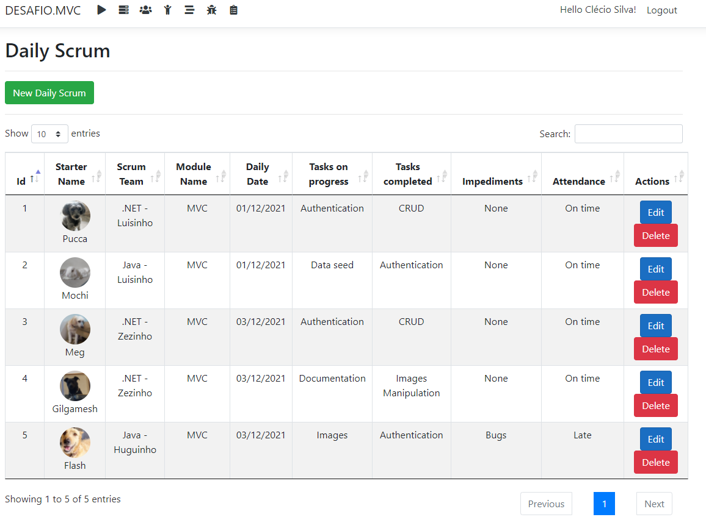

_
Figura 11 - Lista de Dailies vista por um Administrador | Figure 11 - List of active Dailies as seen by an Admin
_

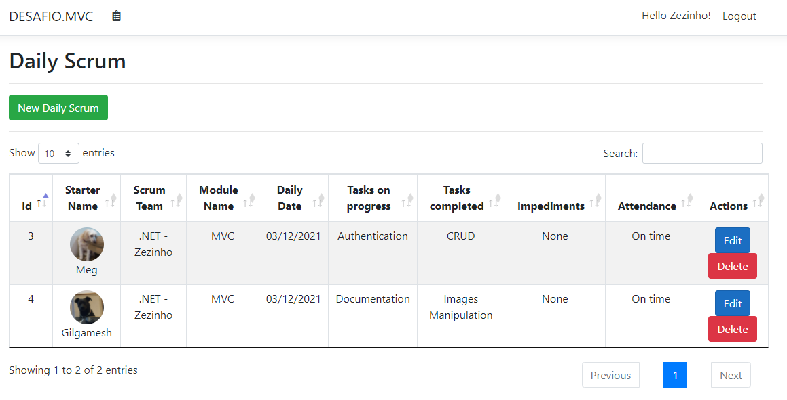

_
Figura 12 - Lista de Dailies vista por um Scrum Master | Figure 12 - List of active Dailies as seen by a Scrum Master
_

As opções de cadastro de uma daily também irão diferir de acordo com o papel do usuário: Administradores poderão cadastrar dailies para qualquer Starter ativo, mas os Scrum Masters poderão cadastrar apenas de Starters que estejam em um de seus times.

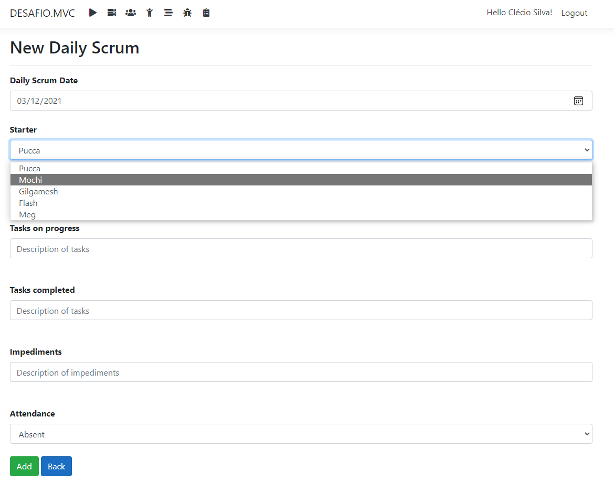

_
Figura 13 - Cadastro de nova daily vista por um Administrador | Figure 13 - Registration of a new daily as seen by an Admin
_

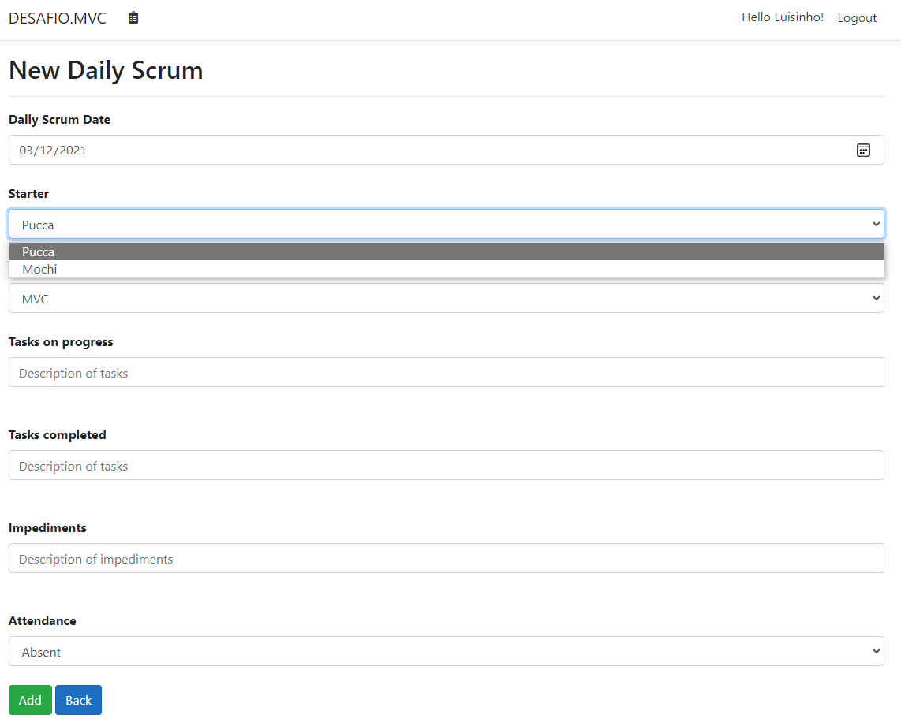

_
Figura 14 - Cadastro de nova daily vista por um Scrum Master | Figure 14 - Registration of a new daily as seen by a Scrum Master
_

**<h3> :page_with_curl: Visualização de Relacionamentos | Relationships Visualizing</h3>**

Caso um registro seja apagado, qualquer outro registro que tenha relacionamento com ele apresentará aquele valor em vermelho. | If a record is deleted, any other registry that has a relationship with the former will present the corresponding value in the color red.

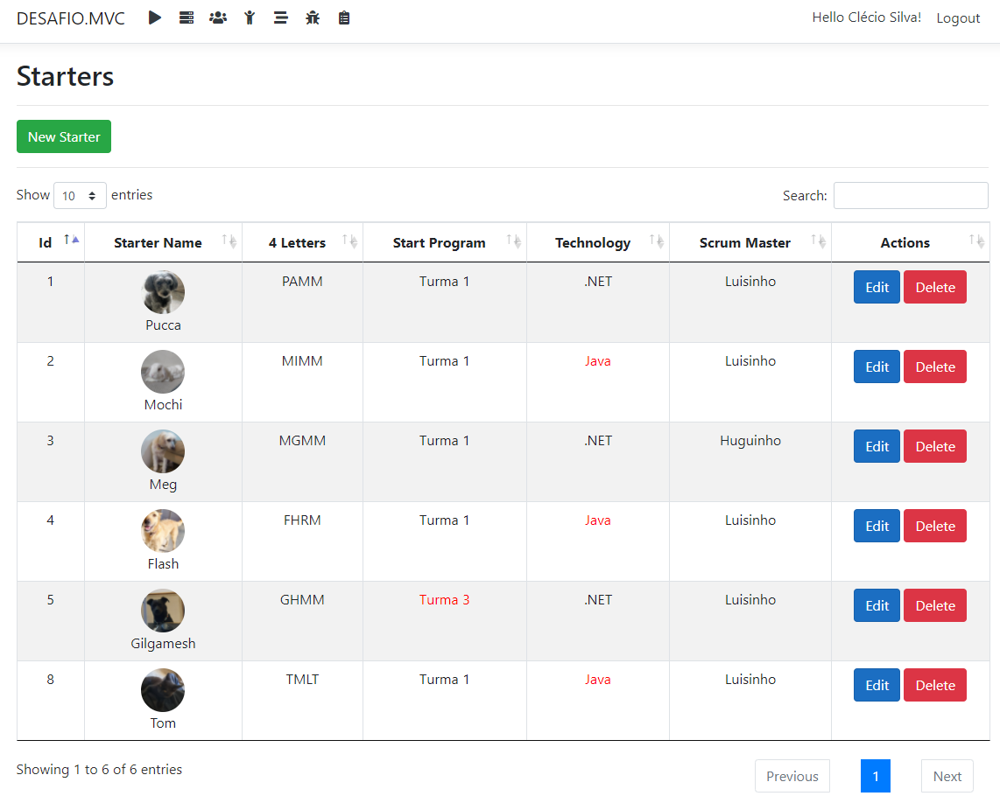

_
Figura 15 - Exemplo de visualização de registros apagados em relacionamentos existentes | Figure 15 - Example of visualizing deleted records in existing relationships 
_

Ademais, ao tentar cadastrar um novo registro cuja entidade possua relacionamento com outro, caso não haja nenhum dado daquela entidade alvo, o programa irá exibir uma mensagem e o botão de submeter a requisição de criar/editar registro estará desabilitado. | Furthermore, when trying to add a new registry whose entity has a relationship with another, the program will display a message and the submit button to creat/edit records will be disabled if there is no active data from the target entity.

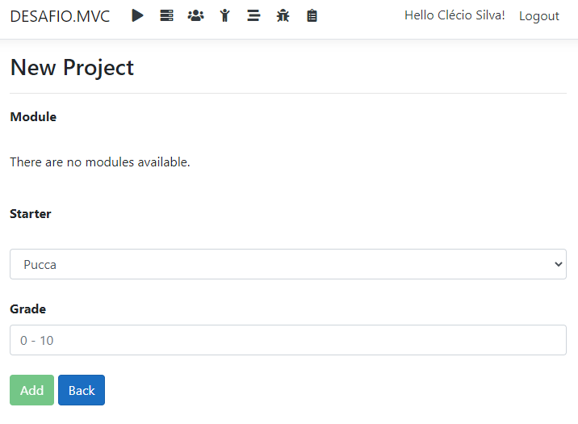

_
Figura 16 - Impossibilidade de cadastro de projeto por falta de registro de módulo | Figure 16 - Impossibility of project registration due to the lack of module records
_